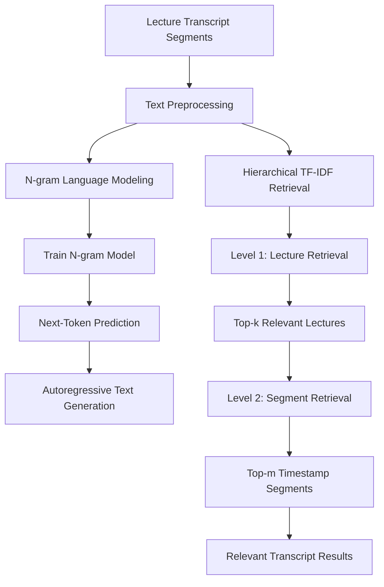

# Lecture Transcript Language Modeling & Hierarchical Retrieval

A modular NLP project for **statistical language modeling** and **hierarchical information retrieval** on lecture transcripts.

The project implements an N-gram language model for autoregressive text generation and a two-stage TF-IDF retrieval system that first identifies relevant lectures and then locates timestamp-level transcript segments.

**Techniques:** N-gram Language Modeling · TF-IDF · Information Retrieval · NLP Preprocessing · Hierarchical Search

> Originally developed as part of the *Introduction to Data Science* coursework at RWTH Aachen University and later refactored into a modular NLP project.
>
> The original course transcript dataset is not redistributed. The demo notebook uses a small synthetic dataset to reproduce the complete pipeline.

---

## Pipeline Architecture



---

## Example Results

### Query 1

```text
gradient descent approach
```

The system retrieves relevant content from:

```text
04-regression
06-neural-networks
```

Example timestamp-level match:

```text
[30–60s]

Gradient descent is an optimization approach used to minimize the loss function.
```

### Query 2

```text
beer and diapers
```

Top lecture:

```text
10-frequent-itemsets
```

Top timestamp-level result:

```text
[30–60s]

A classic example studies customers who buy beer and diapers together.
```

The retrieval pipeline therefore provides both:

- **topic-level localization** through lecture retrieval;
- **fine-grained localization** through timestamp-level segment retrieval.

---

## Core Components

### 1. N-gram Language Modeling

The N-gram model predicts the next token based on the previous \(n-1\) tokens.

For example, a trigram model learns mappings such as:

```text
("gradient", "descent")
        ↓
     "updates"
```

Generation is performed autoregressively:

```text
Context
   ↓
Predict next token
   ↓
Append token
   ↓
Update context
   ↓
Repeat
```

Example output:

```text
N=2
gradient descent updates neural networks consist of layers of layers of layers ...

N=3
gradient descent updates neural network weights during training

N=4
gradient descent updates neural network weights during training
```

This illustrates an important trade-off:

- smaller N-grams provide broader coverage but may generate repetitive or incoherent sequences;
- larger N-grams capture more specific local context but are more affected by data sparsity.

---

### 2. Hierarchical TF-IDF Retrieval

Instead of directly searching all transcript segments, retrieval is performed in two stages.

#### Level 1 — Lecture Retrieval

All transcript segments belonging to the same lecture are combined into a single document.

The query and lecture documents are represented using TF-IDF vectors, and similarity scores are used to retrieve the top-k lectures.

```text
Query
  ↓
TF-IDF Vector
  ↓
Compare with Lecture Vectors
  ↓
Top-k Lectures
```

#### Level 2 — Timestamp Retrieval

Each transcript segment inside the selected lectures is then treated as an individual document.

A second TF-IDF search retrieves the most relevant timestamp-level segments.

```text
Selected Lecture
      ↓
Transcript Segments
      ↓
TF-IDF
      ↓
Query Similarity
      ↓
Top-m Segments
```

---

### 3. Text Preprocessing

The base preprocessing pipeline is:

```text
Lowercasing
    ↓
Punctuation Removal
    ↓
Tokenization
```

For TF-IDF retrieval, additional preprocessing is applied:

```text
Stopword Removal
    ↓
Stemming
```

The preprocessing differs between the two tasks because they have different objectives.

The N-gram model retains function words to preserve local language structure, while the retrieval pipeline removes low-information terms to emphasize discriminative vocabulary.

---

## Project Structure

```text
lecture-transcript-nlp-retrieval/
│
├── src/
│   ├── __init__.py
│   ├── preprocessing.py
│   ├── ngram_model.py
│   └── retrieval.py
│
├── notebooks/
│   └── demo.ipynb
│
├── tests/
│   ├── test_preprocessing.py
│   ├── test_ngram_model.py
│   └── test_retrieval.py
│
├── requirements.txt
├── .gitignore
└── README.md
```

The implementation is separated into reusable modules:

- `preprocessing.py` — tokenization, normalization, stopword removal and stemming
- `ngram_model.py` — N-gram training, next-token prediction and text generation
- `retrieval.py` — lecture indexing, lecture retrieval, segment retrieval and hierarchical search

The complete workflow is demonstrated in:

```text
notebooks/demo.ipynb
```

---

## Quick Start

Create a virtual environment:

```bash
python -m venv .venv
```

Install dependencies:

```bash
pip install -r requirements.txt
```

Download the required NLTK resources:

```python
import nltk

nltk.download("punkt")
nltk.download("punkt_tab")
nltk.download("stopwords")
```

Then open:

```text
notebooks/demo.ipynb
```

and run the notebook from top to bottom.

---

## Limitations & Future Work

The current retrieval system uses TF-IDF, which mainly captures **lexical overlap**.

For example:

```text
reduce prediction error
```

and

```text
minimize the loss function
```

may describe related concepts even though they share few words.

A natural next step is therefore to compare TF-IDF with **embedding-based semantic retrieval**.

Potential extensions include:

- sentence embedding based retrieval;
- semantic similarity search;
- hybrid lexical + semantic retrieval;
- quantitative evaluation using Recall@K or MRR.

The current TF-IDF system can therefore serve as an interpretable lexical baseline for future semantic retrieval experiments.

---

## Tech Stack

- Python
- pandas
- NumPy
- NLTK
- scikit-learn
- Jupyter Notebook